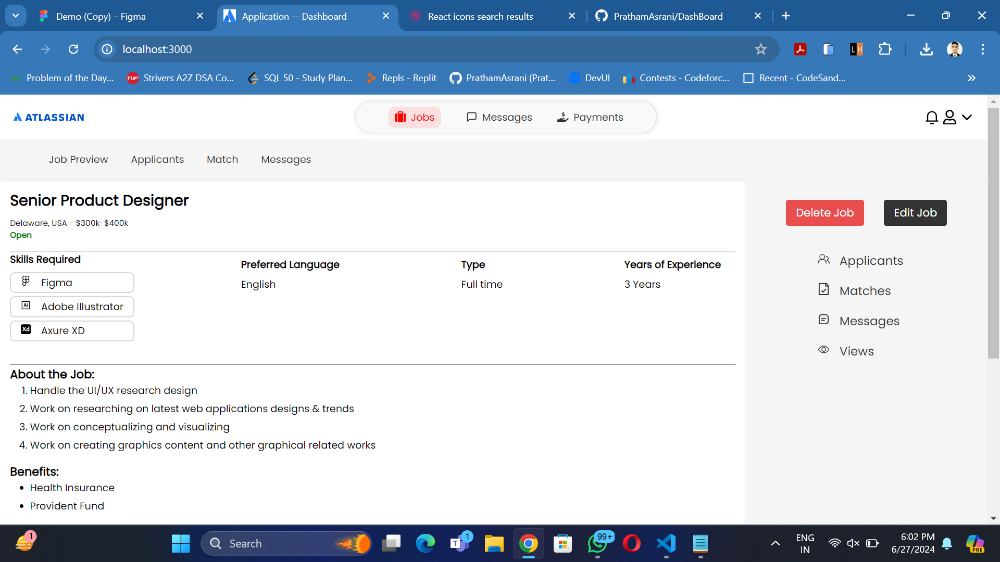
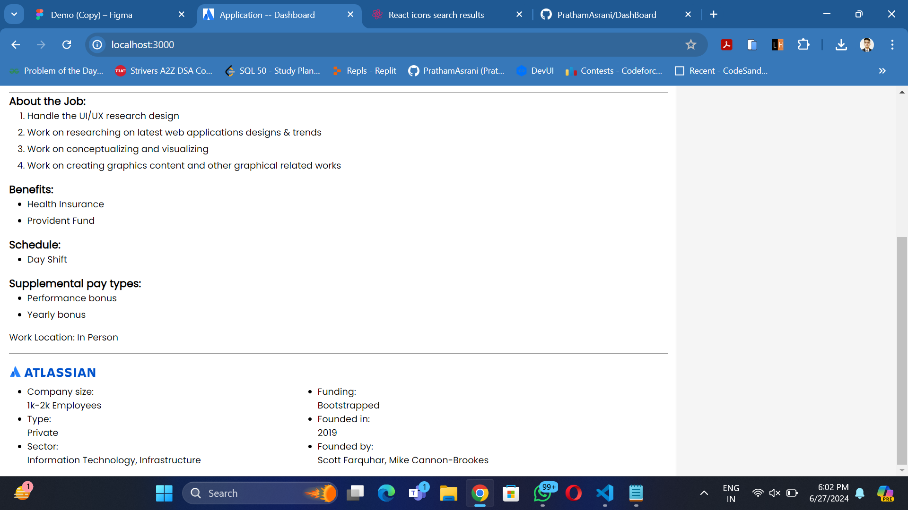
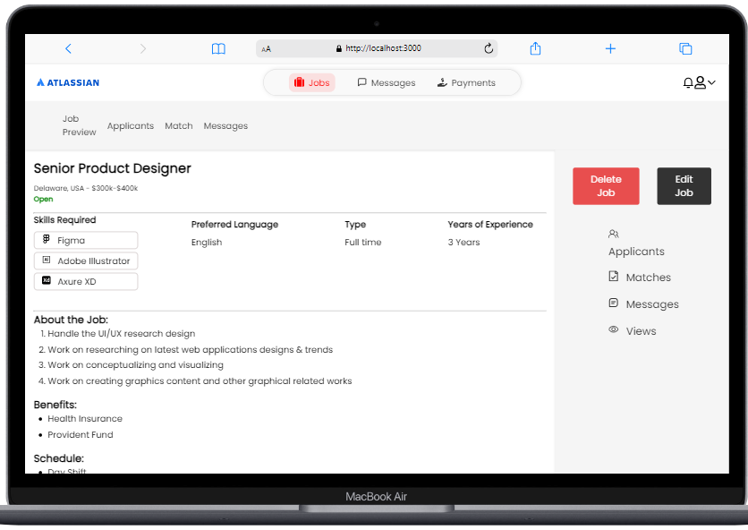
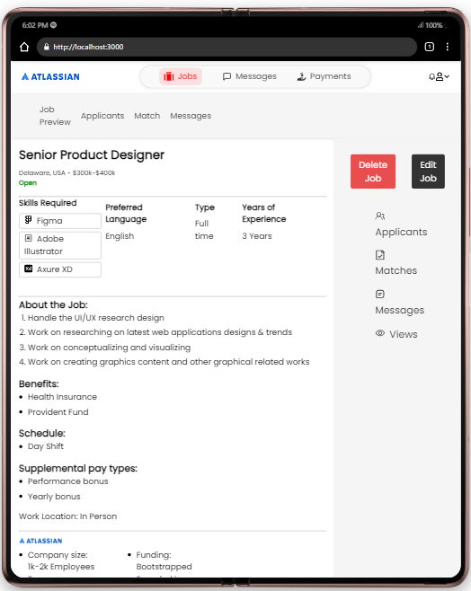
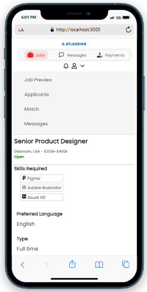
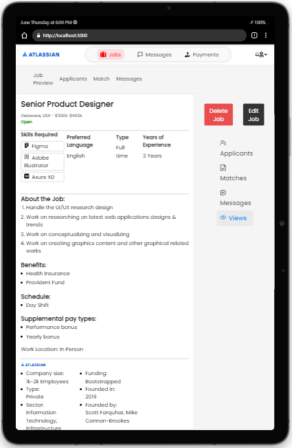

To run the project please run the following commands:
1. open vscode
2. open new terminal in vscode
3. run the following commands
4. git clone https://github.com/PrathamAsrani/DashBoard.git
5. cd DashBoard
6. npm install
7. npm start

8. Desktop View:

9. Laptop View:

10. Samsung Fold View:

11. Phone View:     

12. Tablet View:

